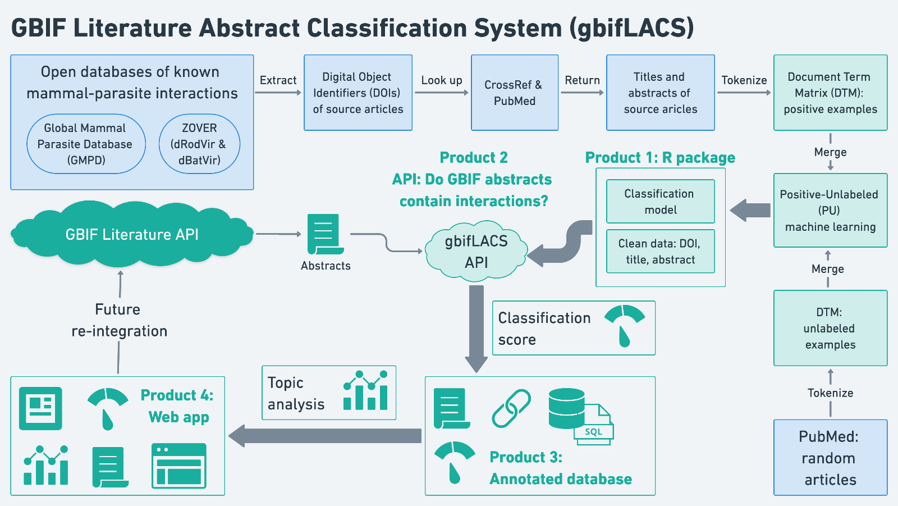

```{r setup, include=FALSE}
library(knitr)
knitr::opts_chunk$set(cache = TRUE)
```

This is GBIF Literature Abstract Classification System. Its designed to score if an abstract from scientific literature its related to host - parasite literature.We use this API to asses GBIF literature in order to find papers related with host - parasite interactions. 

*** 
Try our products, just click on the link in the left bar!


embed_url("https://youtu.be/C49WbusD1xc")

# Introduction

What does GBIF lack? GBIF provides free and open access to over 2 billion occurrence records from species across the tree of life, as well as about 8,000 peer-reviewed publications that describe those records. However, GBIF lacks an efficient means of finding which publications contain *ecological data* regarding the interaction of two or more species -- core information needed to connect occurrences if they were observed interacting (e.g., host-parasite, host-virus). In the context of COVID-19 and previous viral outbreaks of Ebola and Marburg, this type of interaction-based biodiversity information has become essential synthetic risk modeling.

To fill this gap, we here present GBIF LACS – the GBIF Literature Abstract Classification System – a set of workflows for efficiently classifying published abstracts using a machine learning model trained on open databases. The objective of this project is to establish tools for the high-throughput classification of GBIF abstracts related to their contained topics and for use in linking described records in meaningful ways.

Our specific use case is to classify abstracts that are related to *host-parasite interactions*. We accomplish this goal by creating a text classification model trained on (i) abstracts known to contain host-parasite interactions (positive examples); and (ii) abstracts randomly drawn (unlabeled examples). A positive-unlabeled (PU) machine learning model allows to classify the probability that a GBIF given abstract contains host-parasite interactions. We use the GBIF Literature API to filter and search the abstracts that are already linked with GBIF datasets for the presence of host-parasite interactions. The resulting classification scores from the PU model are then annotated on the parsed GBIF abstracts and served in a friendly web app for later re-use.

We additionally carry out a *topic analysis* in order to group the GBIF abstracts in multi-dimensional topic space. These topic groups show trends in GBIF-associated research generally, as well as in the context of host-parasite interactions that are documented in GBIF datasets. Comparison of topic groups relative to PU classification scores are designed to further disentangle research foci of abstracts, and will facilitate later re-integration of this information into GBIF.

Finally, all the information and tools generated for this project are free and openly available for the GBIF community to re-use and apply to additional research questions. Four open-source products were created to help disseminate this work (Fig. 1): (i) an R package called [*abstractsHostParasites*](https://github.com/alrobles/abstractsHostParasites), which includes all tools for generating PU text classification models and processing the associated data; (ii) [*lacsRestAPI*](https://github.com/alrobles/lacsRestAPI), the API used to classify GBIF abstracts relative to the text classification model; (iii) an annotated database of the parsed GBIF abstracts appended with the classification scores ([8 Mb](https://raw.githubusercontent.com/alrobles/abstractsHostParasites/main/data-raw/df_abstracts.csv)); and (iv) the web app hosted at [https://gbif.lacs.info/](https://gbif.lacs.info/) for exploring, downloading, and re-using all project information.

Overall, it is our goal that by linking GBIF abstracts with the underlying ecological interaction records that they describe, we will be one step closer to creating a comprehensive ecological knowledge graph describing Earth’s complex and increasingly threatened ecosystems.


# Objectives
***
We show here a set of tools designed to:

* Find abstracts from literature stored in open databases through PubMed [entrez](https://www.ncbi.nlm.nih.gov/home/develop/api/) API and Cross Reference [crossref](https://api.crossref.org/) 

* Retrieve random abstracts from Cross Reference [crossref](https://api.crossref.org/) 

* Generate models to classify abstracts from a specific topic using PU learning approach

- Deploy a web API with a abstract classification model to evaluate whether or not a given abstract belongs to the class of modeled abstracts

- A GBIF Literature API wrap that retrives GBIF Literature information


# Methodology

The scheme below represents the overall workflow 

```{r gaps map 1, fig.cap="Fig 1. Scheme representing the main steps of the gbif LACS workflow", echo=FALSE, out.width = '80%', fig.align="center"}

```

## Host Parasite models
### Initial data collection
First we retrive research papers information from Global Mammal Parasite Database [gmpd](https://gmpd2.ecology.uga.edu/) and the ZOVER Database  [zover](http://www.mgc.ac.cn/cgi-bin/ZOVER/main.cgi). We extracted all the avaliable citations in both databases. The information available in these open databases does not contain abstracts of the articles, so we had to additionally retrieve them.

We provide these data through the following link in [csv](https://raw.githubusercontent.com/alrobles/abstractsHostParasites/main/data-raw/df_abstracts.csv) format.

### Abstract search
Follow this we search information from [gmpd](https://gmpd2.ecology.uga.edu/) and  [zover](http://www.mgc.ac.cn/cgi-bin/ZOVER/main.cgi) in order to find the abstract and the doi related to each citation in mentioned sources. We search in [crossref](https://www.crossref.org/) and [PubMed](https://pubmed.ncbi.nlm.nih.gov/) using their respective APIs.

### Random abstracts
This text classification problem can be framed as a [one-class classification](https://en.wikipedia.org/wiki/One-class_classification) problem type. For this reason we connected to the [crossref API](https://api.crossref.org/swagger-ui/index.html) to generate a random abstracts table. 

### PU learning
For solving this one-class classification problem, we followed @zhou2022plus to implement their Positive and unlabeled Learning from Unbalanced cases and Sparse structures (PLUS) algorithm. In order to ingest data to this algorithm, we assigned the random abstracts as an unknown class and transformed the abstract table into a Document Term Matrix (DTM), taking in account the n-grams (from 1 to 5). This give us a vocabulary of around 1,500,000 terms in 4,000 documents. We implemented this step in a convenient wrapper that gives a data frame with abstracts of both clases (target class and unknown class) automatically generates both the model and the necessary vocabulary to classify if an abstract belongs to one (target) or another (unknown) class.

Both the abstract search, the generation of random abstracts and the implementation of the PU learning model are available on [github](https://github.com/alrobles/abstractsHostParasites) in our abstractsHostParasites R package. Here we implement an abstract classification model for host parasite literature. 

## REST API model implementation
In order to make available to the entire GBIF community and other research communities we implement our abstract classification model as a REST API following @selivanov2022rest. We share share this code on [github](https://github.com/alrobles/lacsRestAPI). We deploy this API on a personal server at "http://www.vidaanalytics.com:8082/scoreabstract". You also can try our shiny app to copy and paste an abstract to get evaluated. (See below)

## GBIF Literature Analysis
We create a conection throught GBIF Literature API via our gbifliterature R packages avaliable on [GitHub](https://github.com/alrobles/gbifliterature). With this tool we retrive the information in GBIF looking only for peer review papers with abstracts in english language.
We curate this information and provide this data through the following link in [csv](https://raw.githubusercontent.com/alrobles/abstractsHostParasites/main/data-raw/gbif_literature_english.csv) format.


# Products

Try our abstract classification API. 

```{r echo=FALSE}
knitr::include_app(url = "https://alrobles.shinyapps.io/shinyabstractclass",height = "300px")
```
***


***
This is our topic trends we model through literature
```{r echo=FALSE}
knitr::include_app(url = "https://alrobles.shinyapps.io/gbifLiteratureTopics/",height = "600px")
```
***

***
Also try our search engine to discover papers related with mammal - parasite
interactions in PubMed

```{r echo=FALSE}
knitr::include_app(url = "https://www.vidaanalytics.com/shiny/sample-apps/mammals_virus_text_class/",height = "600px")
```